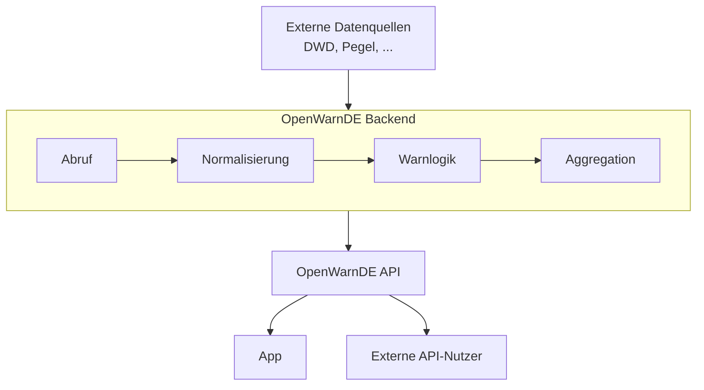

# OpenWarnDE

OpenWarnDE ist eine offene Plattform für öffentliche Gefährdungs- und Warninformationen in Deutschland – mit besonderem Fokus auf die Unterstützung von Feuerwehr und Katastrophenschutz.

## Produktvision

OpenWarnDE soll nicht nur eine App sein, sondern eine zentrale **Daten- und API-Plattform**:

- Öffentliche Warninformationen für Deutschland bereitstellen
- Feuerwehr und Katastrophenschutz mit spezialisierten Ansichten unterstützen
- Eine kartenbasierte Ansicht mit Live-Daten und Nutzerstandort bieten
- Eine modulare Architektur besitzen, die sich leicht um neue Datenquellen, Modi und Warnkonzepte erweitern lässt

Die zentrale Idee von 2.0:

> Die OpenWarnDE App ist ein Client der OpenWarnDE-Plattform. Daten werden zentral gesammelt, verarbeitet, bewertet und über eine eigene API bereitgestellt.

Dadurch muss nicht mehr jedes Endgerät selbst externe Datenquellen abrufen und komplexe Verarbeitung durchführen.

## Bestandteile der Plattform

| Bestandteil            | Aufgabe                                                                                                                                       |
| ---------------------- | --------------------------------------------------------------------------------------------------------------------------------------------- |
| **OpenWarnDE App**     | Primärer Client für Endnutzer (Web, Android, iOS via Capacitor). Zeigt Karte, Warnungen und Standort an, enthält keine eigene Geschäftslogik. |
| **OpenWarnDE Backend** | Zentrale Verarbeitungsschicht: Datenbeschaffung, Validierung, Normalisierung, Warnlogik, Aggregation, Veröffentlichung.                       |
| **OpenWarnDE API**     | Standardisierte, versionierte Schnittstelle (`/api/v1/...`), über die App und externe Nutzer auf Daten zugreifen.                             |
| **Web Platform**       | Betreiber-Dashboard (Admin) sowie – langfristig – eine Developer Platform für externe API-Kunden (API Keys, Usage, Billing).                  |



Die App kommuniziert grundsätzlich **nicht direkt** mit externen Datenquellen (DWD, Pegelstände etc.), sondern ausschließlich über die eigene API. Dadurch können Datenquellen ausgetauscht oder erweitert werden, ohne die App aktualisieren zu müssen.

## Grundprinzipien

- Alle Datenquellen müssen öffentlich, offen und kostenlos verfügbar sein
- Die App bleibt für Endnutzer kostenlos
- Klare Trennung zwischen App-Zugriff (privilegiert, ohne reguläre Limits) und externem API-Zugriff (API Key, Tarif-Limits)
- Alles, was vom Client kommt, gilt als nicht vertrauenswürdig – Berechtigungen werden serverseitig geprüft
- Keine Secrets oder administrativen Zugangsdaten in der App
- API wird von Anfang an versioniert (`/api/v1/`, `/api/v2/`, ...), um bestehende Integrationen nicht zu brechen
- Grundsatz für den Aufbau: *„Modularer Monolith vor Microservice-Overengineering“* – fachliche Trennung zuerst, technische Verteilung nur bei echtem Vorteil

## Geplante Repository-Struktur (Monorepo)

```
openwarn/
├── apps/
│   ├── app/            # OpenWarnDE App (Web, Android, iOS)
│   └── web/             # Admin- und Developer-Platform
├── services/
│   ├── api/              # Öffentliche OpenWarnDE API
│   ├── ingestion/        # Abruf externer Datenquellen
│   ├── processing/       # Normalisierung, Aggregation
│   ├── warnings/         # Warnregeln und -logik
│   ├── notifications/    # Push-Benachrichtigungen
│   └── usage/            # API-Usage-Tracking / Billing-Vorbereitung
├── packages/
│   ├── types/
│   ├── validation/
│   ├── config/
│   ├── api-contract/     # Gemeinsames API-Vertragsmodell (Single Source of Truth)
│   └── ui/
├── firebase/              # Firebase-Infrastrukturkonfiguration
├── docs/
│   ├── definition.md      # Vollständige Architektur- und Repository-Definition
│   ├── 01-project/ … 08-operations/
├── tests/
└── scripts/
```

Diese Struktur ist ein **Architekturentwurf** für den MVP; nicht jede Komponente muss von Anfang an als eigener Service existieren – ein anfänglicher `services/backend/`-Monolith mit klar getrennten Modulen ist explizit zulässig.

## API

Die OpenWarnDE API liefert ein eigenes, von den Datenquellen unabhängiges Datenmodell (z. B. `Warning`, `Region`, `Severity`) statt externe Formate direkt durchzureichen.

- Versioniert: `GET /api/v1/warnings`
- Einheitliches Response-Format mit `data`/`meta` bzw. `error`/`meta`
- **App-Zugriff:** privilegiert, ohne reguläres Tageslimit
- **Externe Nutzer:** benötigen einen API Key; Free Tier zunächst mit 24 Requests/Tag geplant, darüber hinaus perspektivisch kostenpflichtige Tarife (Basic/Pro/Business)

Details siehe [`docs/definition.md`](docs/definition.md).

## Aktueller Status

Der Fokus liegt aktuell **nicht** auf Billing, Microservices oder einer vollständigen Developer Platform, sondern auf der fachlichen Planungsphase:

```
OpenWarnDEV verstehen → Ist-Zustand dokumentieren → Probleme identifizieren
→ Zielzustand definieren → Anforderungen ableiten → MVP festlegen
```

Vorläufig festgelegt: Monorepo, App als Client, zentrale Datenverarbeitung, Firebase als Infrastruktur, eigene versionierte API, Web Platform mit Admin-Bereich, Developer Platform als langfristiges Ziel, API Keys, Free Tier, API Limits, Usage Tracking.

Noch offen: konkrete Billing-Lösung, konkrete API-Authentifizierung, konkretes Datenmodell, konkrete Firebase-Services, Deployment- und Tarifstruktur.

## Herkunft

OpenWarnDE 2.0 baut auf den Erkenntnissen von [OpenWarnDEV](https://github.com/FlorianCramer/OpenWarnDEV) auf – dort existiert bereits eine funktionierende Web-App (<https://openwarnde.web.app/>) mit interaktiver 3D-Karte (MapLibre GL, OpenFreeMap), Standortanzeige, rechtlichem Quellenmodal und Grundlagen für einen geschützten Einsatzmodus.

## Dokumentation

- [`docs/definition.md`](docs/definition.md) – vollständige Architektur- und Repository-Definition (Konzeptentwurf, Version 0.1)
- Weitere Dokumentation folgt in `docs/01-project/` bis `docs/08-operations/`, sobald die jeweiligen Planungsschritte abgeschlossen sind
