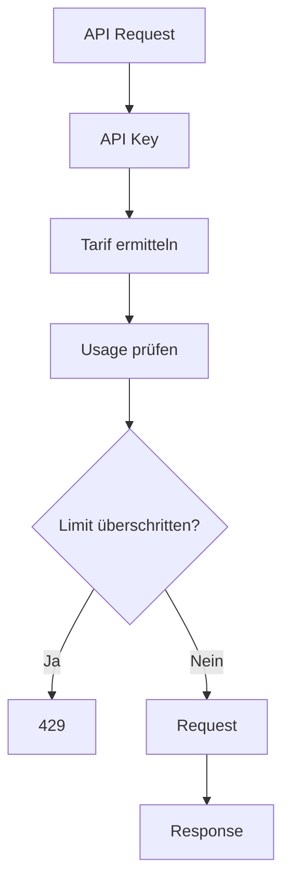
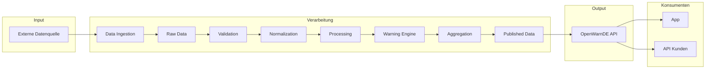

# OpenWarnDE 2.0 – Repository- und API-Architektur

**Status:** Konzeptentwurf  
**Version:** 0.1  
**Zweck:** Definition der grundlegenden Repository-, Backend-, API- und Produktstruktur von OpenWarnDE 2.0

---

# 1. Zielbild

OpenWarnDE 2.0 soll als zentrale Plattform aufgebaut werden.

Das System besteht grundsätzlich aus:

1. OpenWarnDE App
2. OpenWarnDE Admin / Web Platform
3. OpenWarnDE Backend
4. OpenWarnDE API
5. Datenverarbeitung
6. zentraler Datenhaltung
7. externen Datenquellen

Die zentrale Idee lautet:

> Die OpenWarnDE App ist ein Client der OpenWarnDE-Plattform. Daten werden zentral gesammelt, verarbeitet, bewertet und über eine eigene API bereitgestellt.

Dadurch soll verhindert werden, dass jedes Endgerät selbst externe Datenquellen abrufen und komplexe Datenverarbeitung durchführen muss.

---

# 2. Zielarchitektur

Die grundlegende Kommunikation soll folgendermaßen funktionieren:

```text
                        Externe Datenquellen
                                │
              ┌─────────────────┼─────────────────┐
              │                 │                 │
             DWD              Pegel          weitere Quellen
              │                 │                 │
              └─────────────────┼─────────────────┘
                                │
                                ▼
                       OpenWarnDE Backend
                                │
                  ┌─────────────┴─────────────┐
                  │                           │
                  ▼                           ▼
             Datenabruf                  Verarbeitung
                  │                           │
                  └─────────────┬─────────────┘
                                ▼
                         Normalisierung
                                │
                                ▼
                         Warnlogik / Analyse
                                │
                                ▼
                         Aggregation
                                │
                                ▼
                       Published Data
                                │
                  ┌─────────────┴──────────────┐
                  │                            │
                  ▼                            ▼
            OpenWarnDE API                interne Datenzugriffe
                  │
        ┌─────────┴──────────┐
        │                    │
        ▼                    ▼
   OpenWarnDE App       externe API-Nutzer
   unbegrenzt         mit API-Key / Limits
                         / Billing
```

---

# 3. Grundprinzip der Plattform

OpenWarnDE soll nicht ausschließlich als App entwickelt werden.

Die eigentliche Plattform ist das Backend.

Die App ist ein Client.

Die API ist die standardisierte Schnittstelle zwischen Client und Plattform.

Das bedeutet:

```text
                        OpenWarnDE Plattform
                                │
                         OpenWarnDE Backend
                                │
                         OpenWarnDE API
                                │
               ┌────────────────┴────────────────┐
               │                                 │
               ▼                                 ▼
         OpenWarnDE App                     API-Kunden / Dritte
```

Die OpenWarnDE App erhält dabei einen privilegierten Zugriff.

Externe Anbieter erhalten einen kontrollierten API-Zugang.

---

# 4. OpenWarnDE App

Die OpenWarnDE App ist der primäre Client der Plattform.

Sie soll:

- Warnungen abrufen
- Karteninformationen abrufen
- Regionen abrufen
- veröffentlichte Lageinformationen abrufen
- Benutzereinstellungen verwalten
- Push-Benachrichtigungen empfangen
- Standortinformationen verwenden
- Daten darstellen

Die App soll grundsätzlich keine externen Datenquellen direkt verarbeiten.

Beispiel:

Falsch:

```text
    Smartphone
        ↓
    DWD API
        ↓
    Pegel API
        ↓
    eigene Berechnung
        ↓
    Anzeige
```

Ziel:

```text
    Smartphone
        ↓
    OpenWarnDE API
        ↓
    fertige OpenWarnDE-Daten
        ↓
    Anzeige
```

---

# 5. OpenWarnDE Backend

Das Backend ist die zentrale Verarbeitungsschicht.

Es übernimmt:

- Datenbeschaffung
- Datenvalidierung
- Datennormalisierung
- Datenaggregation
- Warnlogik
- Risikobewertung
- regionale Zuordnung
- Speicherung
- Veröffentlichung
- API-Bereitstellung
- Push-Auslösung
- Monitoring
- API-Nutzungserfassung
- externe API-Authentifizierung

Das Backend muss unabhängig davon laufen, ob ein Benutzer die Admin-Weboberfläche geöffnet hat.

---

# 6. OpenWarnDE Admin / Web Platform

Der Admin-Bereich wird langfristig zu einer umfassenden Web-Plattform.

Die Plattform hat zwei Hauptbereiche:

## 6.1 Interner Betreiberbereich

Dieser Bereich ist ausschließlich für den Betreiber / Administrator bestimmt.

Mögliche Funktionen:

- Dashboard
- Systemstatus
- Datenquellen
- Warnungen
- Regionen
- Nutzer
- Geräte
- Push
- Datenqualität
- Systemlogs
- Auswertungen
- Konfiguration
- API-Monitoring
- Billing-Übersicht
- API-Kunden
- API Keys
- Limits

## 6.2 Öffentliche / externe Entwicklerplattform

Zusätzlich soll die Web-Plattform später einen Bereich für externe API-Nutzer anbieten.

Beispielsweise:

```text
    OpenWarnDE
    ├── App
    ├── Admin
    └── Developer Platform
```

Die Developer Platform kann später enthalten:

- Registrierung
- Login
- API-Dokumentation
- API Keys
- Projekte
- Usage
- Limits
- Abrechnung
- Tarifverwaltung
- API-Status

---

# 7. Firebase als zentrale Infrastruktur

OpenWarnDE soll grundsätzlich über ein gemeinsames Firebase-Projekt betrieben werden.

Beispiel:

```text
    Firebase Project
    │
    ├── Hosting
    │   ├── App
    │   └── Web Platform
    │
    ├── Authentication
    │
    ├── Firestore
    │
    ├── Cloud Functions / Backend
    │
    ├── Scheduler
    │
    ├── Cloud Messaging
    │
    └── weitere benötigte Dienste
```

Die genaue Auswahl der Firebase-Dienste wird später in der technischen Architektur festgelegt.

Firebase ist die Infrastrukturplattform.

Die fachliche Architektur von OpenWarnDE bleibt davon getrennt.

---

# 8. Repository-Struktur

Das Projekt soll als Monorepo aufgebaut werden.

Zielstruktur:

```text
    openwarnde/
    │
    ├── apps/
    │   ├── app/
    │   └── web/
    │
    ├── services/
    │   ├── api/
    │   ├── ingestion/
    │   ├── processing/
    │   ├── warnings/
    │   ├── notifications/
    │   └── usage/
    │
    ├── packages/
    │   ├── types/
    │   ├── validation/
    │   ├── config/
    │   ├── api-contract/
    │   └── ui/
    │
    ├── firebase/
    │   ├── firestore.rules
    │   ├── firestore.indexes.json
    │   └── ...
    │
    ├── docs/
    │   ├── definition.md
    │   ├── 01-project/
    │   ├── 02-requirements/
    │   ├── 03-concept/
    │   ├── 04-architecture/
    │   ├── 05-api/
    │   ├── 06-development/
    │   ├── 07-testing/
    │   └── 08-operations/
    │
    ├── tests/
    │
    ├── scripts/
    │
    ├── .github/
    │   ├── ISSUE_TEMPLATE/
    │   ├── workflows/
    │   └── PULL_REQUEST_TEMPLATE.md
    │
    ├── .editorconfig
    ├── .gitignore
    ├── .gitattributes
    ├── README.md
    ├── CONTRIBUTING.md
    ├── SECURITY.md
    ├── LICENSE
    ├── package.json
    ├── firebase.json
    └── .firebaserc
```

---

# 9. apps/

Der Ordner apps enthält ausschließlich Benutzeroberflächen.

```text
    apps/
    │
    ├── app/
    │
    └── web/
```

## 9.1 apps/app

Hier liegt die eigentliche OpenWarnDE App.

Ziel:

- Web
- Android (Capacitor)
- iOS (Capacitor)

Beispiel:

```text
    apps/app/
    ├── src/
    ├── public/
    └── ...
```

Die App kommuniziert mit der OpenWarnDE API.

## 9.2 apps/web

Die Web Platform enthält:

- Admin
- Developer Platform
- API Management
- Billing
- Account Management

Die genaue interne Struktur wird später festgelegt.

Es ist bewusst nicht vorgesehen, `admin` und die öffentliche Developer Platform zwangsläufig als zwei vollständig getrennte Anwendungen zu betreiben.

Beide können zunächst innerhalb einer Web Platform liegen und serverseitig über Rollen und Berechtigungen getrennt werden.

---

# 10. services/

Der Ordner services enthält serverseitige Komponenten.

```text
    services/
    │
    ├── api/
    ├── ingestion/
    ├── processing/
    ├── warnings/
    ├── notifications/
    └── usage/
```

## 10.1 services/api

Verantwortlich für die öffentliche OpenWarnDE API.

Aufgaben:

- HTTP Requests
- Routing
- Authentifizierung
- API-Key-Validierung
- Rate Limiting
- Berechtigungen
- Response-Format
- Fehlerbehandlung
- API-Versionierung
- Usage Tracking

## 10.2 services/ingestion

Verantwortlich für den Abruf externer Datenquellen.

Beispiel:

```text
    Scheduler
        ↓
    Ingestion
        ↓
    DWD
        ↓
    Raw Data
```

## 10.3 services/processing

Verantwortlich für:

- Normalisierung
- Transformation
- Aggregation
- Datenvalidierung
- Verarbeitung

## 10.4 services/warnings

Verantwortlich für:

- Warnregeln
- Schwellwerte
- Warnstufen
- regionale Zuordnung
- Erzeugung veröffentlichter Warnungen

## 10.5 services/notifications

Verantwortlich für:

- Push Notifications
- Benachrichtigungslogik
- FCM
- Versandstatus

## 10.6 services/usage

Verantwortlich für:

- API Requests zählen
- Usage speichern
- Limits prüfen
- Abrechnung vorbereiten
- Nutzungsstatistiken

---

# 11. packages/

Packages enthalten gemeinsam verwendbare Bausteine.

```text
    packages/
    │
    ├── types/
    ├── validation/
    ├── config/
    ├── api-contract/
    └── ui/
```

---

# 12. API Contract

Ein besonders wichtiger Package ist:

```text
    packages/api-contract/
```

Dort wird das gemeinsame API-Vertragsmodell definiert.

Ziel:

Die App und das Backend sollen nicht unabhängig voneinander irgendwelche JSON-Strukturen erfinden.

Beispiel:

```text
    API Contract
         ↓
    WarningResponse
         ↓
    Backend
         ↓
    OpenWarnDE App
```

Der API Contract soll unter anderem definieren:

- Request-Strukturen
- Response-Strukturen
- Fehlerformate
- Pagination
- Filter
- Versionierung
- Typen
- Validierung

Die API soll dadurch langfristig als eigenes Produkt behandelt werden können.

---

# 13. Eigene OpenWarnDE API

OpenWarnDE soll eine eigene API besitzen.

Die API ist nicht lediglich eine direkte Weiterleitung auf externe Datenquellen.

Sie stellt ein eigenes OpenWarnDE-Datenmodell bereit.

Beispiel:

```text
    GET /api/v1/warnings
```

liefert OpenWarnDE-Warnungen.

Nicht:

```text
    GET /api/dwd/...
```

Die Herkunft der Daten ist für den API-Nutzer möglichst unabhängig vom internen Datenmodell.

---

# 14. API-Versionierung

Die API soll von Anfang an versioniert werden.

Beispiel:

```text
    /api/v1/warnings
```

später:

```text
    /api/v2/warnings
```

Die Versionierung soll verhindern, dass Änderungen an der API automatisch bestehende Kundenintegrationen zerstören.

Eine neue API-Version soll eingeführt werden, wenn Breaking Changes notwendig werden.

---

# 15. API Response Format

OpenWarnDE soll ein einheitliches Response-Format besitzen.

Beispiel:

```json
    {
      "data": {
        ...
      },
      "meta": {
        "requestId": "...",
        "generatedAt": "..."
      }
    }
```

Bei Fehlern:

```json
    {
      "error": {
        "code": "RATE_LIMIT_EXCEEDED",
        "message": "API request limit exceeded."
      },
      "meta": {
        "requestId": "..."
      }
    }
```

Das genaue Format wird im API-Konzept definiert.

---

# 16. OpenWarnDE App Zugriff

Die OpenWarnDE App soll einen privilegierten Zugriff auf die OpenWarnDE API erhalten.

Ziel:

- keine regulären API-Limits
- vollständiger Zugriff auf für die App freigegebene Endpunkte
- optimierte Kommunikation
- Push-Unterstützung
- möglicherweise spezielle interne Endpunkte

Wichtig:

Die App soll trotzdem nicht automatisch Zugriff auf administrative oder interne Backend-Funktionen erhalten.

---

# 17. Externe API-Nutzer

Dritte sollen die OpenWarnDE API später selbst verwenden können.

Beispiele:

- Webseiten
- Apps
- Smart-Home-Systeme
- Informationssysteme
- Unternehmen
- Entwickler
- kommunale Anwendungen
- weitere Plattformen

Dafür benötigen sie einen API Key.

---

# 18. API-Key-System

Die Developer Platform soll es ermöglichen, API Keys zu erstellen.

Beispiel:

```text
    Benutzer
        ↓
    Developer Platform
        ↓
    Projekt erstellen
        ↓
    API Key erstellen
        ↓
    API verwenden
```

Ein API Key soll nicht direkt einem Benutzerkonto gleichgesetzt werden.

Besser:

```text
    Account
       │
       ├── Project A
       │      ├── API Key
       │      └── Usage
       │
       └── Project B
              ├── API Key
              └── Usage
```

Dadurch können später mehrere Anwendungen / Projekte pro Kunde verwaltet werden.

---

# 19. API Limits

Das API-System soll zwischen der OpenWarnDE App und externen API-Kunden unterscheiden.

## OpenWarnDE App

Die offizielle OpenWarnDE App soll grundsätzlich ohne das normale externe API-Limit funktionieren.

Beispiel:

```text
    OpenWarnDE App
        ↓
    OpenWarnDE API
        ↓
    privilegierter Client
        ↓
    kein reguläres Tageslimit
```

## Externe API-Kunden

Externe Nutzer erhalten abhängig vom Tarif Limits.

Beispiel:

```text
    Free
    24 Requests / Tag

    Paid
    höhere Limits

    Business
    noch höhere Limits

    Enterprise
    individuell
```

Die konkreten Preise und Limits sind noch nicht festgelegt.

---

# 20. Free API Tier

Der kostenlose API-Zugang soll zunächst beispielsweise enthalten:

    24 Requests pro Tag

Das entspricht bewusst keinem vollständigen Echtzeitzugriff.

Der Free Tier dient primär dazu:

- API auszuprobieren
- Entwicklung zu ermöglichen
- Dokumentation zu testen
- kleine Integrationen zu ermöglichen

Die tatsächliche Definition des Free Tiers wird später festgelegt.

---

# 21. Paid API

Für höheren Verbrauch soll eine kostenpflichtige Nutzung möglich sein.

Mögliche Modelle:

## Subscription

Beispiel:

```text
    Basic
    Professional
    Business
```

mit jeweils definierten Limits.

## Usage Based Billing

Alternativ oder zusätzlich:

```text
    Preis pro 1.000 Requests
```

oder:

```text
    Grundgebühr + verbrauchsabhängige Kosten
```

Die endgültige Preisstrategie wird später definiert.

---

# 22. API Usage

Jeder externe API Request soll nachvollziehbar erfasst werden können.

Beispiel:

```text
    API Request
        ↓
    API Authentication
        ↓
    Limit Check
        ↓
    Request Processing
        ↓
    Usage Event
        ↓
    Usage Storage
```

Mögliche Daten:

- API Key / Key-ID
- Account
- Project
- Endpoint
- HTTP Method
- Timestamp
- Status Code
- Response Time
- Request Count
- Datenmenge
- Tarif
- Verbrauch

Sensible Daten sollen nicht unnötig gespeichert werden.

---

# 23. Rate Limiting

API Limits sollen serverseitig durchgesetzt werden.

Beispiel:



Bei Überschreitung soll ein standardisierter Fehler zurückgegeben werden.

Beispiel:

```env
    HTTP 429
    RATE_LIMIT_EXCEEDED
```

---

# 24. API Billing

Die Developer Platform soll später Abrechnung unterstützen.

Mögliche Funktionen:

- Tarif auswählen
- Zahlungsmethode verwalten
- Rechnungen anzeigen
- Usage anzeigen
- Limits anzeigen
- Tarif wechseln
- API Keys verwalten

Die technische Zahlungsabwicklung wird separat als Architekturentscheidung behandelt.

Ein möglicher späterer Dienst wäre beispielsweise ein externer Payment Provider.

---

# 25. Trennung von App-Zugriff und API-Kunden

Ein wichtiger Sicherheits- und Architekturgrundsatz:

```text
    OpenWarnDE App ≠ externer API Client
```

Die App soll nicht einfach einen öffentlich sichtbaren API Key enthalten, der unbegrenzt von jedem kopiert werden kann.

Die offizielle App benötigt deshalb eine eigene Authentifizierungs- und Zugriffsmethode.

Mögliche spätere Ansätze:

- Firebase Authentication
- App Check
- kurzlebige Tokens
- Device Registration
- signierte Requests
- Kombination mehrerer Verfahren

Die konkrete Methode wird später im Sicherheitskonzept festgelegt.

---

# 26. Keine Secrets in der App

API-Secrets, private Schlüssel oder administrative Zugangsdaten dürfen niemals fest in der App ausgeliefert werden.

Nicht erlaubt:

```ts
    const API_SECRET = "secret";
```

Die App enthält nur Informationen, die als öffentlich betrachtet werden können.

Sensible Berechtigungen werden serverseitig verwaltet.

---

# 27. Datenfluss

Der geplante Datenfluss sieht folgendermaßen aus:



---

# 28. Admin-Datenfluss

Der Admin greift auf zusätzliche interne Daten zu.

```text
    Backend
       │
       ├── Published Data
       │
       ├── Raw Data
       │
       ├── Processing Status
       │
       ├── Usage
       │
       ├── Configuration
       │
       └── System Metrics
              │
              ▼
        Admin / Web Platform
```

Der Admin darf dadurch wesentlich mehr Informationen sehen als die öffentliche App.

---

# 29. Zentrale Datenhaltung

Die Datenhaltung soll mindestens logisch unterscheiden zwischen:

```text
    raw/
    normalized/
    processed/
    published/
```

Zusätzlich können Bereiche existieren für:

```text
    users/
    devices/
    regions/
    dataSources/
    api/
    usage/
    system/
    configuration/
```

Die konkrete Datenbankstruktur wird später im Datenmodell definiert.

---

# 30. Scheduler und Hintergrundverarbeitung

Die Datenverarbeitung darf nicht vom Öffnen der Web Platform abhängig sein.

Stattdessen:

```text
    Scheduler
        ↓
    Processing Job
        ↓
    Daten abrufen
        ↓
    Daten verarbeiten
        ↓
    Daten speichern
        ↓
    Published Data aktualisieren
```

Die Web Platform zeigt lediglich den Zustand an und ermöglicht Konfiguration.

---

# 31. Beispiel eines vollständigen Ablaufs

Eine neue DWD-Warnung entsteht.

```text
    DWD
      ↓
    Scheduler startet Job
      ↓
    Ingestion lädt Daten
      ↓
    Daten werden validiert
      ↓
    Daten werden normalisiert
      ↓
    Warning Engine verarbeitet Warnung
      ↓
    Region wird bestimmt
      ↓
    Warnung wird gespeichert
      ↓
    Published Data wird aktualisiert
      ↓
    API stellt Warnung bereit
      ↓
    OpenWarnDE App ruft Daten ab
      ↓
    App zeigt Warnung
      ↓
    optional:
    Push Notification wird ausgelöst
```

Ein externer API-Kunde kann anschließend dieselbe veröffentlichte Warnung über einen API Request abrufen.

---

# 32. API als eigenständiges Produkt

Die API soll nicht nur als internes technisches Detail betrachtet werden.

Langfristig soll die OpenWarnDE API ein eigenständiges Produkt darstellen.

Dafür werden benötigt:

- stabile API-Verträge
- Versionierung
- Dokumentation
- API Keys
- Usage Tracking
- Rate Limits
- Billing
- Developer Portal
- Monitoring
- Statusinformationen
- Changelog
- Support

Dadurch kann OpenWarnDE langfristig neben der App auch eine Plattform für Drittanbieter werden.

---

# 33. Repository und Produktstruktur

Die Repository-Struktur soll die fachliche Architektur widerspiegeln.

```text
    openwarnde/
    │
    ├── apps/
    │   ├── app/
    │   │   └── OpenWarnDE Client
    │   │
    │   └── web/
    │       └── Admin + Developer Platform
    │
    ├── services/
    │   ├── api/
    │   │   └── OpenWarnDE API
    │   │
    │   ├── ingestion/
    │   │   └── Datenbeschaffung
    │   │
    │   ├── processing/
    │   │   └── Datenverarbeitung
    │   │
    │   ├── warnings/
    │   │   └── Warnlogik
    │   │
    │   ├── notifications/
    │   │   └── Push
    │   │
    │   └── usage/
    │       └── API Usage / Billing
    │
    ├── packages/
    │   ├── types/
    │   ├── validation/
    │   ├── config/
    │   ├── api-contract/
    │   └── ui/
    │
    ├── firebase/
    │   └── Firebase Konfiguration
    │
    ├── docs/
    │   ├── definition.md
    │   ├── 01-project/
    │   ├── 02-requirements/
    │   ├── 03-concept/
    │   ├── 04-architecture/
    │   ├── 05-api/
    │   ├── 06-development/
    │   ├── 07-testing/
    │   └── 08-operations/
    │
    ├── tests/
    ├── scripts/
    └── .github/
```

---

# 34. Technische Grenzen

Die Repository-Struktur ist zunächst ein Architekturentwurf.

Nicht jede geplante Komponente muss sofort als eigener Service implementiert werden.

Beispielsweise kann der erste MVP technisch noch so aussehen:

```text
    services/
    └── backend/
```

mit mehreren Modulen:

```text
    backend/
    ├── api/
    ├── ingestion/
    ├── processing/
    ├── warnings/
    └── usage/
```

Erst wenn Skalierung, Deployment oder Wartbarkeit es rechtfertigen, können daraus eigenständige Services entstehen.

Grundsatz:

> Fachliche Trennung zuerst, technische Verteilung nur wenn sie einen echten Vorteil bringt.

---

# 35. MVP der Plattform

Der erste MVP sollte noch kein vollständiges API-Business sein.

Ein sinnvoller MVP könnte enthalten:

## App

- Karte
- Standort
- Warnungen
- Warnungsdetails
- API-Kommunikation

## Backend

- eine oder wenige Datenquellen
- Ingestion
- Normalisierung
- Warnverarbeitung
- Published Data
- API

## Web Platform

- Admin Login
- Dashboard
- Datenquellenstatus
- Warnungsübersicht
- Systemstatus

## API

- API v1
- grundlegende Endpunkte
- OpenAPI-Dokumentation
- interne App-Authentifizierung

---

# 36. Spätere API-Plattform

Nach dem funktionierenden MVP:

```text
    Developer Platform
        ↓
    Account
        ↓
    Project
        ↓
    API Key
        ↓
    Free Tier
        ↓
    Usage Tracking
        ↓
    Rate Limiting
        ↓
    Paid Plans
        ↓
    Billing
```

Diese Funktionen werden bewusst als späterer Produktbereich behandelt.

---

# 37. Sicherheitsprinzipien

Folgende Grundsätze gelten:

1. Administrative Funktionen sind geschützt.
2. API Keys werden niemals als Passwörter behandelt.
3. API Secrets werden nicht in Clients gespeichert.
4. Berechtigungen werden serverseitig geprüft.
5. Rate Limits werden serverseitig durchgesetzt.
6. Usage wird serverseitig erfasst.
7. App-Zugriff und Drittanbieterzugriff werden getrennt.
8. Rohdaten werden nicht unnötig öffentlich gemacht.
9. Administrative Daten sind nicht Bestandteil der öffentlichen API.
10. Jede API-Version wird kontrolliert veröffentlicht.

---

# 38. Dokumentation

Die API erhält eine eigene Dokumentation.

Vorgesehen:

```text
    docs/05-api/
    ├── overview.md
    ├── authentication.md
    ├── rate-limits.md
    ├── errors.md
    ├── versioning.md
    ├── usage.md
    └── billing.md
```

Zusätzlich soll später eine maschinenlesbare API-Spezifikation entstehen.

Beispielsweise:

```text
    OpenAPI Specification
```

Damit können daraus später automatisch API-Dokumentationen und Client-Code erzeugt werden.

---

# 39. Architekturentscheidungen

Die folgenden Punkte sind aktuell Konzeptentscheidungen und noch nicht endgültig technisch umgesetzt:

- Monorepo
- Firebase als zentrale Infrastruktur
- separate App
- zentrale Web Platform
- serverseitige Datenverarbeitung
- eigene OpenWarnDE API
- API-Versionierung
- API Keys für externe Nutzer
- Free Tier
- Paid API
- Usage Tracking
- perspektivisch API Billing

Jede wichtige technische Entscheidung wird später als Architecture Decision Record dokumentiert.

Beispiel:

```text
    docs/04-architecture/adr/

    ADR-001-monorepo.md
    ADR-002-firebase.md
    ADR-003-api-versioning.md
    ADR-004-api-authentication.md
    ADR-005-api-billing.md
```

---

# 40. Wichtigste Architekturentscheidung

Die zentrale Architekturentscheidung für OpenWarnDE 2.0 lautet:

> OpenWarnDE wird als zentrale Daten- und API-Plattform aufgebaut.

Die App ist der primäre Client.

Die Web Platform ist die Betreiber- und Entwickleroberfläche.

Das Backend verarbeitet und aggregiert die Daten.

Die OpenWarnDE API stellt standardisierte Daten bereit.

Externe API-Nutzer erhalten kontrollierten Zugriff über API Keys, Limits und perspektivisch Billing.

---

# 41. Zielbild

Das langfristige Zielbild:

```text
                             OPENWARNDE
                                  │
                     ┌────────────┴────────────┐
                     │                         │
               OpenWarnDE Platform          OpenWarnDE API
                     │                         │
          ┌──────────┼──────────┐              │
          │          │          │              │
          ▼          ▼          ▼              ▼
       Ingestion  Processing  Storage      API Clients
          │          │          │          ┌────┴────┐
          └──────────┼──────────┘          │         │
                     │                   App      Dritte
                     │
             ┌───────┴────────┐
             │                │
             ▼                ▼
        OpenWarnDE App     Web Platform
                           │
                    ┌──────┴──────┐
                    │             │
                  Admin       Developer
                                Portal
                                  │
                         ┌────────┼────────┐
                         │        │        │
                      API Keys  Usage   Billing
```

---

# 42. Nächster Planungsschritt

Diese Architektur ist noch kein Pflichtenheft.

Als nächstes muss das fachliche Zielbild definiert werden.

Die Reihenfolge soll sein:

1. Ist-Analyse von OpenWarnDEV
2. Projektdefinition
3. Stakeholder und Zielgruppen
4. funktionale Anforderungen
5. nichtfunktionale Anforderungen
6. API-Anforderungen
7. Anforderungen an App
8. Anforderungen an Web Platform
9. Anforderungen an Backend
10. Sicherheitsanforderungen
11. MVP
12. Lastenheft
13. fachliches Datenmodell
14. Pflichtenheft
15. technische Architektur
16. API-Spezifikation
17. Implementierung

Die konkrete Technologie wird erst nach diesen Schritten endgültig festgelegt.

---

# 43. Leitgedanke

OpenWarnDE 2.0 soll nicht lediglich eine App werden.

OpenWarnDE soll eine Plattform werden, deren Kern aus zentraler Datenverarbeitung und einer standardisierten API besteht.

Die OpenWarnDE App ist der wichtigste Client und erhält privilegierten Zugriff.

Dritte können die OpenWarnDE API kontrolliert und kostenpflichtig verwenden.

Damit entsteht langfristig aus:

    Warn-App

eine:

    Warn- und Datenplattform

mit:

    App
    +
    Backend
    +
    Web Platform
    +
    API
    +
    Developer Platform
    +
    Usage / Billing


# 44. Trennung der Verantwortlichkeiten

Die einzelnen Bestandteile von OpenWarnDE sollen klar voneinander getrennte Verantwortlichkeiten besitzen.

## 44.1 App

Die App ist für die Benutzerinteraktion verantwortlich.

Sie soll:

- Daten darstellen
- Benutzereingaben entgegennehmen
- Standortinformationen verwalten
- lokale Einstellungen verwalten
- Push-Benachrichtigungen empfangen
- API-Daten abrufen
- Daten für die Darstellung aufbereiten

Die App soll keine zentrale Geschäftslogik enthalten, die für alle Benutzer identisch ausgeführt werden muss.

Beispiel:

```text
    App
      ↓
    "Welche Warnungen gelten für mich?"
      ↓
    API
      ↓
    fertige Daten
```

## 44.2 Backend

Das Backend ist für die zentrale Geschäftslogik verantwortlich.

Es soll:

- Datenquellen abrufen
- Daten validieren
- Daten normalisieren
- Daten zusammenführen
- Warnungen bewerten
- Daten aggregieren
- veröffentlichte Daten erzeugen
- API Requests verarbeiten
- Berechtigungen prüfen
- API Usage erfassen
- Hintergrundaufgaben ausführen

## 44.3 Web Platform

Die Web Platform ist die zentrale Verwaltungsschnittstelle.

Sie soll:

- Systeminformationen anzeigen
- Daten analysieren
- Konfiguration ermöglichen
- API-Zugänge verwalten
- API Usage anzeigen
- Kunden verwalten
- später Billing ermöglichen

# 45. Keine direkte Datenquellen-Kommunikation durch die App

Ein wichtiger Architekturgrundsatz lautet:

> Die OpenWarnDE App kommuniziert nicht direkt mit den externen Datenquellen.

Nicht:

```text
    App
      ├── DWD
      ├── Pegel
      ├── Wetterdienst
      └── weitere APIs
```

Sondern:

```text
    App
      ↓
    OpenWarnDE API
      ↓
    OpenWarnDE Backend
      ↓
    Datenquellen
```

Dadurch kann OpenWarnDE die Datenquellen austauschen oder erweitern, ohne die App aktualisieren zu müssen.

# 46. Vorteile der zentralen Verarbeitung

Die zentrale Verarbeitung bringt mehrere Vorteile.

## Einheitliche Daten

Alle Clients erhalten dieselbe Datenbasis.

## Weniger Client-Komplexität

Die App muss keine komplexe Datenverarbeitung durchführen.

## Schnellere Weiterentwicklung

Neue Datenquellen können serverseitig integriert werden.

## Kontrolle

Der Betreiber kann nachvollziehen:

- welche Daten verarbeitet wurden
- wann Daten verarbeitet wurden
- welche Daten veröffentlicht wurden
- ob Datenquellen funktionieren

## Performance

Berechnungen werden zentral durchgeführt.

Die App erhält möglichst fertige Daten.

## API-Produkt

Die bereits verarbeiteten Daten können sowohl für die App als auch für externe API-Kunden genutzt werden.


# 47. Unterschied zwischen internen und öffentlichen Daten

Nicht alle Backend-Daten dürfen über die öffentliche API verfügbar sein.

Daher wird zwischen verschiedenen Datenebenen unterschieden.

```text
    RAW DATA
        ↓
    INTERNAL DATA
        ↓
    PROCESSED DATA
        ↓
    PUBLISHED DATA
```

## RAW DATA

Originaldaten der Datenquellen.

Diese Daten sind grundsätzlich intern.

## INTERNAL DATA

Daten, die während der Verarbeitung entstehen.

Diese sind ebenfalls nicht öffentlich.

## PROCESSED DATA

Verarbeitete und normalisierte Daten.

Diese können teilweise für interne Systeme verfügbar sein.

## PUBLISHED DATA

Daten, die für die OpenWarnDE API freigegeben wurden.

Nur diese Daten dürfen über die öffentliche API bereitgestellt werden.

# 48. Public API vs. Internal API

Das Backend sollte logisch zwischen internen und öffentlichen Schnittstellen unterscheiden.

Beispiel:

```text
    Internal API
        ↓
    Admin / Backend / interne Services

    Public API
        ↓
    OpenWarnDE App
    externe API-Kunden
```

Die interne API darf wesentlich umfangreichere Funktionen bereitstellen.

Beispielsweise:

```text
    GET /internal/data-sources
    POST /internal/data-sources
    GET /internal/processing/jobs
    GET /internal/system/metrics
```

Die öffentliche API könnte dagegen nur veröffentlichte Informationen bereitstellen:

```text
    GET /api/v1/warnings
    GET /api/v1/warnings/{id}
    GET /api/v1/regions
    GET /api/v1/status
```

# 49. OpenWarnDE API als Produktgrenze

Die Public API stellt eine klare Grenze zwischen OpenWarnDE und externen Clients dar.

```text
    ┌───────────────────────────────┐
    │       OpenWarnDE Backend        │
    │                               │
    │  Datenquellen                 │
    │  Verarbeitung                 │
    │  Warnlogik                    │
    │  Datenhaltung                 │
    │                               │
    └───────────────┬───────────────┘
                    │
                    │ OpenWarnDE API
                    │
    ┌───────────────┴───────────────┐
    │                               │
    ▼                               ▼
OpenWarnDE App                 externe Kunden
```

Externe Nutzer sollen nicht wissen müssen, wie OpenWarnDE intern Daten sammelt und verarbeitet.


# 50. API-Abstraktion

Die OpenWarnDE API soll eine Abstraktion über den zugrunde liegenden Datenquellen darstellen.

Beispiel:

```text
    DWD
    ├── Format A
    ├── Feld X
    └── Feld Y

    OpenWarnDE
    ├── Warning
    ├── severity
    ├── region
    └── validUntil
```

Ein API-Kunde arbeitet ausschließlich mit dem OpenWarnDE-Datenmodell.

Dadurch kann OpenWarnDE intern Datenquellen verändern, ohne dass externe Kunden ihre Integration ändern müssen.

# 51. Datenmodell als Produktbestandteil

Das OpenWarnDE-Datenmodell wird dadurch zu einem zentralen Bestandteil der Plattform.

Beispielsweise:

```text
    Warning
    Region
    Location
    DataSource
    Event
    Severity
    Validity
    Geometry
```

Diese Modelle sollen nicht von einzelnen Anwendungen unabhängig voneinander definiert werden.

Sie werden zentral dokumentiert und versioniert.

# 52. API Contract als Single Source of Truth

Der API Contract soll als zentrale Quelle für die Kommunikation zwischen Backend und Clients dienen.

```text
    packages/api-contract/
              │
       ┌──────┴──────┐
       │             │
       ▼             ▼
    Backend         App
       │
       ▼
    Public API
```

Der Contract soll möglichst automatisiert validierbar sein.

Ziel:

```text
    API geändert
        ↓
    Contract Tests
        ↓
    Breaking Change erkannt
```

# 53. API-Request-Lifecycle

Ein externer Request soll ungefähr folgenden Ablauf durchlaufen:

```text
    Client
      ↓
    HTTPS
      ↓
    API Gateway / API Service
      ↓
    Authentication
      ↓
    API Key Validierung
      ↓
    Account / Project bestimmen
      ↓
    Tarif bestimmen
      ↓
    Rate Limit prüfen
      ↓
    Berechtigung prüfen
      ↓
    Request verarbeiten
      ↓
    Usage erfassen
      ↓
    Response
      ↓
    Client
```

# 54. API Key Lebenszyklus

Ein API Key soll einen definierten Lebenszyklus besitzen.

```text
    Erstellung
       ↓
    Aktiv
       ↓
    Nutzung
       ↓
    Rotation
       ↓
    Deaktivierung
       ↓
    Löschung
```

API Keys sollen niemals dauerhaft ohne Möglichkeit zur Deaktivierung existieren.

Ein Benutzer muss einen kompromittierten API Key deaktivieren können.

# 55. API Key Darstellung

Ein API Key sollte nach Möglichkeit nur bei der Erstellung vollständig angezeigt werden.

Beispiel:

```text
    API Key:
    ow_live_****************
```

Nach der Erstellung soll nur eine gekürzte Darstellung angezeigt werden.

Beispiel:

```text
    ow_live_8F2A...91KD
```

Die eigentlichen Secrets sollen nicht unnötig in der Web Platform angezeigt werden.

# 56. Projekte für API-Kunden

Ein API-Kunde soll mehrere Projekte verwalten können.

Beispiel:

```text
    Unternehmen
       │
       ├── Website
       │      └── API Key
       │
       ├── Mobile App
       │      └── API Key
       │
       └── Smart Home
              └── API Key
```

Dadurch kann Usage getrennt ausgewertet werden.

# 57. API-Tarife

Die Tarifstruktur soll technisch flexibel gestaltet werden.

Beispiel:

```text
    FREE
    ├── 24 Requests / Tag
    └── Basiszugriff

    BASIC
    ├── höheres Request-Limit
    └── Basiszugriff

    PRO
    ├── hohes Request-Limit
    ├── erweiterte Funktionen
    └── höhere Priorität

    BUSINESS
    ├── individuelle Limits
    ├── erweiterte Funktionen
    └── Support
```

Die tatsächlichen Tarife, Preise und Leistungen werden später festgelegt.

# 58. App-Zugriff ist kein Tarif

Die offizielle OpenWarnDE App soll nicht über das normale externe Tarifmodell abgerechnet werden.

Das bedeutet:

```text
    OpenWarnDE App
        ↓
    App Authentication
        ↓
    App Access
```

und:

```text
    Drittanbieter
        ↓
    API Key
        ↓
    Tarif
        ↓
    Limit
        ↓
    API
```

Damit wird verhindert, dass die OpenWarnDE App durch das öffentliche Free-Tier-Limit eingeschränkt wird.

# 59. Push-System

Push-Benachrichtigungen sollen ebenfalls zentral vom Backend gesteuert werden.

Beispiel:

```text
    Neue Warnung
         ↓
    Warning Engine
         ↓
    Relevanz bestimmen
         ↓
    Push Event
         ↓
    Firebase Cloud Messaging
         ↓
    OpenWarnDE App
```

Die App muss nicht selbst feststellen, ob eine neue Warnung entstanden ist.

Das Backend kann aktiv eine Benachrichtigung auslösen.

# 60. Polling und Push

OpenWarnDE kann langfristig beide Verfahren verwenden.

## Polling

Die App fragt regelmäßig:

```text
    GET /api/v1/warnings
```

Vorteile:

- einfach
- zuverlässig
- App kann selbst aktualisieren

## Push

Das Backend sendet bei relevanten Änderungen eine Benachrichtigung.

Vorteile:

- schnell
- weniger unnötige Requests
- bessere Nutzererfahrung

Beide Verfahren können kombiniert werden.

Beispiel:

```text
    Push
      ↓
    "Neue Warnung verfügbar"
      ↓
    App
      ↓
    API Request
      ↓
    aktuelle Warnung laden
```

# 61. App Cache

Die App soll nicht bei jeder Darstellung zwingend das komplette Backend neu abfragen.

Eine spätere Client-Architektur kann einen lokalen Cache verwenden.

Beispiel:

```text
    API
      ↓
    App Data Layer
      ↓
    Cache
      ↓
    UI
```

Dadurch kann die App:

- schneller reagieren
- Daten offline verfügbar machen
- Netzwerkzugriffe reduzieren

# 62. API Caching

Auch serverseitig können häufig angefragte Daten zwischengespeichert werden.

Beispiel:

```text
    Client
      ↓
    API
      ↓
    Cache
      ↓
    Published Data
```

Dies ist insbesondere für häufig abgefragte öffentliche Daten relevant.

Caching wird später abhängig von Datenaktualität und Infrastruktur entschieden.

# 63. Aktualität der Daten

Jede veröffentlichte Information soll einen Aktualitätskontext besitzen.

Beispiel:

```text
    generatedAt
    updatedAt
    validFrom
    validUntil
    sourceUpdatedAt
```

Dadurch kann ein Client erkennen, wie aktuell eine Information ist.

# 64. Datenqualität

Da OpenWarnDE Informationen aus externen Quellen verarbeitet, muss Datenqualität berücksichtigt werden.

Mögliche Zustände:

```text
    VALID
    WARNING
    INVALID
    STALE
    UNKNOWN
```

Beispiel:

```text
    Datenquelle
        ↓
    letzter erfolgreicher Abruf:
    10:31 Uhr

    erwarteter Abruf:
    alle 5 Minuten

    aktueller Zustand:
    STALE
```

Die Web Platform soll solche Zustände sichtbar machen.

# 65. Monitoring

Das Backend soll überwacht werden.

Mögliche Kennzahlen:

- erfolgreiche Datenabrufe
- fehlgeschlagene Datenabrufe
- Verarbeitungsdauer
- Anzahl verarbeiteter Warnungen
- API Requests
- API Fehler
- Rate Limit Überschreitungen
- Push-Ausfälle
- Datenquellenstatus


Die Admin Platform soll diese Informationen später aggregiert darstellen.


# 66. Auditierbarkeit

Administrative Aktionen sollen nachvollziehbar sein.

Beispiel:

```text
    Administrator
        ↓
    änderte Datenquelle
        ↓
    Zeitpunkt
        ↓
    vorheriger Wert
        ↓
    neuer Wert
```

Besonders relevante Änderungen sollen protokolliert werden.

Beispiele:

- Konfigurationsänderungen
- API-Key-Aktionen
- Tarifänderungen
- Berechtigungsänderungen
- Datenquellenänderungen

# 67. Rollenmodell

Die Web Platform soll ein Rollenmodell besitzen.

Beispielsweise:

```text
    OWNER
    ADMIN
    OPERATOR
    ANALYST
    DEVELOPER
```

Für das erste Projekt kann zunächst ausschließlich:

```text
    OWNER
```

implementiert werden.

Weitere Rollen können später hinzukommen.

# 68. Owner

Der Owner besitzt vollständigen Zugriff auf die Betreiberfunktionen.

Mögliche Berechtigungen:

- System konfigurieren
- Datenquellen verwalten
- Warnungen verwalten
- API verwalten
- Nutzer verwalten
- API Keys verwalten
- Usage ansehen
- Billing verwalten
- Systemstatus ansehen


# 69. Developer Account

Ein externer Entwickler soll ausschließlich Zugriff auf seine eigenen Ressourcen besitzen.

Beispiel:

```text
    Developer A
        ↓
    Project A
        ↓
    API Key A
        ↓
    Usage A
```

Developer A darf nicht sehen:

```text
    Developer B
    Project B
    Usage B
```

Die Autorisierung muss serverseitig erfolgen.

# 70. Mandantenfähigkeit

Die Developer Platform sollte perspektivisch mandantenfähig aufgebaut werden.

Grundprinzip:

```text
    Account
       │
       ├── Projects
       │
       ├── API Keys
       │
       ├── Usage
       │
       └── Billing
```

Jede Ressource muss eindeutig einem Account bzw. Projekt zugeordnet sein.

# 71. Billing und API Usage trennen

API Usage und Billing sind fachlich miteinander verbunden, aber technisch unterschiedliche Bereiche.

Usage beantwortet:

> Wie viel wurde verwendet?

Billing beantwortet:

> Was muss dafür bezahlt werden?

Daher:

```text
    API Request
        ↓
    Usage
        ↓
    Billing Calculation
        ↓
    Invoice / Payment
```

Dadurch kann die Billing-Logik später verändert werden, ohne die API selbst neu zu bauen.

# 72. Kostenkontrolle

Das System muss verhindern, dass interne Prozesse unkontrolliert Kosten verursachen.

Besonders relevant:

- externe APIs
- Cloud Functions
- Datenbankzugriffe
- Scheduler
- Storage
- API Traffic
- Push

Die Admin Platform soll später relevante Verbrauchswerte anzeigen können.

# 73. Entwicklungsprinzip

Die Plattform soll zunächst modular, aber nicht unnötig kompliziert aufgebaut werden.

Grundsatz:

> Modularer Monolith vor Microservice-Overengineering.

Das bedeutet:

Fachliche Bereiche werden sauber getrennt.

Sie müssen aber nicht sofort als vollständig voneinander getrennte Deployments betrieben werden.

# 74. Beispiel einer initialen Backend-Struktur

Eine mögliche erste Umsetzung:

```text
    services/backend/
    │
    ├── api/
    │   ├── routes/
    │   ├── middleware/
    │   └── controllers/
    │
    ├── ingestion/
    │   ├── sources/
    │   └── jobs/
    │
    ├── processing/
    │   ├── normalization/
    │   └── aggregation/
    │
    ├── warnings/
    │   ├── rules/
    │   └── services/
    │
    ├── usage/
    │
    └── shared/
```

Diese Struktur kann später bei Bedarf in einzelne Services aufgeteilt werden.

# 75. Infrastruktur vs. Anwendung

Die Repository-Struktur soll unterscheiden zwischen:

```text
    Infrastruktur
```

und:

```text
    OpenWarnDE Anwendung
```

Firebase-Konfiguration gehört beispielsweise in:

```text
    firebase/
```

Die OpenWarnDE Geschäftslogik gehört in:

```text
    services/
```

Die App gehört in:

```text
    apps/app/
```

Die Web Platform gehört in:

```text
    apps/web/
```

Dadurch bleibt die Architektur nachvollziehbar.

# 76. Deployment-Zielbild

Langfristig:

```text
    GitHub
       ↓
    CI/CD
       ↓
    Build
       ↓
    Tests
       ↓
    Deployment
       ↓
    Firebase / Cloud
```

Mögliche Deployments:

```text
    apps/app
        ↓
    Firebase Hosting / App Hosting

    apps/web
        ↓
    Firebase Hosting / App Hosting

    Backend
        ↓
    Cloud Functions / geeignete Backend-Infrastruktur
```

Die konkrete Deploymentstrategie wird später definiert.

# 77. Entwicklungsumgebungen

Es sollen mindestens folgende Umgebungen berücksichtigt werden:

```text
    Development
    Staging
    Production
```

## Development

Für lokale Entwicklung.

## Staging

Für Integrationstests und Release-Kandidaten.

## Production

Für echte Nutzer und API-Kunden.

Nicht jede Umgebung muss im MVP sofort vollständig eingerichtet werden.

# 78. Konfiguration

Umgebungsspezifische Werte dürfen nicht hart im Code hinterlegt werden.

Beispiele:

```text
    API URLs
    Firebase Project IDs
    Feature Flags
    externe API Credentials
    Payment Provider Credentials
```

Secrets gehören in eine geeignete Secret-Management-Lösung.

# 79. Feature Flags

Später können Feature Flags eingesetzt werden.

Beispiel:

```text
    API_BILLING_ENABLED
    NEW_WARNING_ENGINE_ENABLED
    DEVELOPER_PORTAL_ENABLED
```

Dadurch können Funktionen kontrolliert aktiviert werden.

# 80. API Dokumentation

Die API soll für externe Entwickler verständlich dokumentiert werden.

Die Dokumentation soll enthalten:

- Getting Started
- Authentication
- API Keys
- Endpoints
- Request Examples
- Response Examples
- Error Codes
- Rate Limits
- Versioning
- Changelog
- Usage
- Billing

Ziel:

Ein Entwickler soll die OpenWarnDE API ohne direkte Unterstützung integrieren können.

# 81. OpenAPI

Die API soll langfristig eine OpenAPI-Spezifikation besitzen.

Beispiel:

```text
    docs/05-api/
    └── openapi.yaml
```

oder eine entsprechend generierte Spezifikation.

Die OpenAPI-Spezifikation soll möglichst aus dem tatsächlichen API Contract bzw. der API Implementierung hervorgehen.

# 82. API-Kompatibilität

Breaking Changes sollen vermieden werden.

Eine Änderung wie:

```text
    severity
```

zu:

```text
    level
```

darf nicht einfach in einer bestehenden API-Version erfolgen.

Stattdessen:

```text
    /api/v1/
```

bestehende Struktur bleibt stabil.

Bei Breaking Changes:

```text
    /api/v2/
```

# 83. API Fehler

Fehler sollen einheitlich aufgebaut sein.

Beispiel:

```json
    {
      "error": {
        "code": "INVALID_API_KEY",
        "message": "The provided API key is invalid."
      },
      "meta": {
        "requestId": "..."
      }
    }
```

Mögliche Fehlercodes:

```text
    INVALID_API_KEY
    API_KEY_REVOKED
    RATE_LIMIT_EXCEEDED
    FORBIDDEN
    NOT_FOUND
    INVALID_REQUEST
    INTERNAL_ERROR
    SERVICE_UNAVAILABLE
```

# 84. Request IDs

Jeder API Request soll möglichst eine eindeutige Request-ID erhalten.

Beispiel:

```text
    X-Request-ID
```

oder Bestandteil der Response:

```text
    meta.requestId
```

Dies erleichtert:

- Debugging
- Support
- Monitoring
- Fehleranalyse

# 85. API Security

Die API soll ausschließlich über HTTPS erreichbar sein.

Zusätzlich sollen unter anderem berücksichtigt werden:

- Authentication
- Authorization
- Rate Limiting
- Input Validation
- Request Size Limits
- Logging
- Abuse Prevention
- Secret Management
- CORS
- Security Headers

Die konkrete Umsetzung erfolgt im Sicherheitskonzept.

# 86. Abuse Prevention

Der Free Tier mit 24 Requests pro Tag darf nicht dazu führen, dass beliebig viele Accounts erstellt werden, um das Limit zu umgehen.

Daher müssen langfristig Maßnahmen gegen Missbrauch berücksichtigt werden.

Beispielsweise:

- Account Verification
- API Key Limits
- Device / App Identification
- Abuse Detection
- IP-basierte Schutzmechanismen
- App Check
- Request Pattern Analysis

Die konkrete Umsetzung wird später festgelegt.

# 87. App-Zugriff absichern

Die offizielle App darf nicht einfach einen geheimen API Key enthalten.

Ein möglicher späterer Ansatz:

```text
    App
      ↓
    Firebase Authentication / App Check
      ↓
    OpenWarnDE Backend
      ↓
    App Authorization
      ↓
    API
```

Die App kann dadurch als offizieller OpenWarnDE Client erkannt werden.

Die konkrete Architektur ist noch offen.

# 88. Keine Vertrauensannahme beim Client

Ein wichtiger Sicherheitsgrundsatz:

> Alles, was vom Client kommt, muss als nicht vertrauenswürdig betrachtet werden.

Das gilt auch für:

- App
- Browser
- API Client
- API Key
- Request Parameter

Berechtigungen müssen serverseitig geprüft werden.

# 89. Datenmodell und API-Modell trennen

Das interne Datenmodell muss nicht identisch mit dem öffentlichen API-Modell sein.

Beispiel:

Intern:

```text
    Firestore Warning Document
    ├── internalProcessingState
    ├── sourcePayload
    ├── normalizedData
    ├── internalFlags
    └── ...
```

Public API:

```text
    Warning
    ├── id
    ├── title
    ├── severity
    ├── region
    ├── validFrom
    └── validUntil
```

Dadurch bleibt die interne Architektur flexibel.

# 90. Ziel der Repository-Struktur

Die Repository-Struktur soll folgende Fragen eindeutig beantworten:

```text
    Wo liegt die App?
        → apps/app/

    Wo liegt die Web Platform?
        → apps/web/

    Wo liegt die API?
        → services/api/

    Wo findet Datenbeschaffung statt?
        → services/ingestion/

    Wo findet Verarbeitung statt?
        → services/processing/

    Wo liegt die Warnlogik?
        → services/warnings/

    Wo wird API Usage verarbeitet?
        → services/usage/

    Wo liegen gemeinsame Typen?
        → packages/types/

    Wo liegt der API Contract?
        → packages/api-contract/

    Wo liegt Firebase?
        → firebase/

    Wo liegt die Dokumentation?
        → docs/
```

# 91. Aktueller Architekturstatus

Folgende Punkte gelten als vorläufig festgelegt:

```text
    [x] Monorepo
    [x] OpenWarnDE App als Client
    [x] zentrale Datenverarbeitung
    [x] Firebase als zentrale Infrastruktur
    [x] eigene OpenWarnDE API
    [x] API-Versionierung
    [x] Web Platform
    [x] interner Admin-Bereich
    [x] Developer Platform als langfristiges Ziel
    [x] API Keys für externe Kunden
    [x] Free Tier
    [x] API Limits
    [x] Usage Tracking
    [ ] konkrete Billing-Lösung
    [ ] konkrete API-Authentifizierung
    [ ] konkretes Datenmodell
    [ ] konkrete Firebase Services
    [ ] konkrete Deploymentarchitektur
    [ ] konkrete Tarifstruktur
    [ ] konkrete Preisgestaltung
```

# 92. Nächster fachlicher Planungsschritt

Nach der Repository- und Architektur-Grundidee darf noch nicht direkt implementiert werden.

Als nächstes muss die Ist-Analyse von OpenWarnDEV durchgeführt werden.

Dabei werden insbesondere untersucht:

```text
    1. Repository-Struktur
    2. App
    3. Admin
    4. Firebase
    5. Backend
    6. Datenquellen
    7. Datenmodell
    8. Authentication
    9. Push
    10. Hosting
    11. Capacitor
    12. bestehende APIs
    13. technische Schulden
    14. bestehende Features
    15. wiederverwendbare Komponenten
```

# 93. Vorgehensmodell

Die Entwicklung von OpenWarnDE 2.0 soll nach folgendem Schema erfolgen:

```text
    IST
     ↓
    ANALYSE
     ↓
    DEFINITION
     ↓
    ANFORDERUNGEN
     ↓
    LASTENHEFT
     ↓
    MVP
     ↓
    FACHLICHES KONZEPT
     ↓
    PFLICHTENHEFT
     ↓
    ARCHITEKTUR
     ↓
    API CONTRACT
     ↓
    IMPLEMENTIERUNGSPLAN
     ↓
    ENTWICKLUNG
     ↓
    TEST
     ↓
    RELEASE
     ↓
    MONITORING
     ↓
    ITERATION
```

# 94. Wichtiges Entwicklungsprinzip

OpenWarnDE 2.0 wird nicht nach dem Prinzip:

```text
    "Ich baue zuerst die App und mache den Rest später."
```

entwickelt.

Stattdessen:

```text
    "Ich definiere zuerst das System und seine Schnittstellen."
```

Die App ist nur ein Client.

Die Web Platform ist nur eine Verwaltungsschnittstelle.

Das Backend ist der zentrale Verarbeitungskern.

Die API ist die definierte Grenze zwischen OpenWarnDE und seinen Clients.

# 95. Langfristige Vision

OpenWarnDE soll langfristig drei miteinander verbundene Produkte bilden:

```text
    1. OpenWarnDE App

    2. OpenWarnDE Platform

    3. OpenWarnDE API
```

Die OpenWarnDE App bietet Endnutzern einen möglichst einfachen Zugang.

Die OpenWarnDE Platform ermöglicht dem Betreiber und später Entwicklern die Verwaltung des Systems.

Die OpenWarnDE API ermöglicht Drittanbietern, auf standardisierte OpenWarnDE-Daten zuzugreifen.

Damit kann OpenWarnDE langfristig von einer einzelnen Anwendung zu einer eigenständigen technischen Plattform wachsen.

# 96. Grundsatz für die weitere Planung

Die aktuell beschriebene Architektur ist eine Zielarchitektur.

Sie darf nicht dazu führen, dass der MVP unnötig komplex wird.

Jede technische Entscheidung soll anhand folgender Fragen bewertet werden:

1. Welches Problem löst sie?
2. Wird sie für den aktuellen Scope benötigt?
3. Erhöht sie Wartbarkeit?
4. Erhöht sie Sicherheit?
5. Erhöht sie Skalierbarkeit?
6. Erhöht sie die Komplexität?
7. Gibt es eine einfachere Lösung?
8. Ist die Entscheidung reversibel?
9. Welche langfristigen Auswirkungen besitzt sie?

# 97. Definition of Done für die Planungsphase

Die Planungsphase gilt erst als ausreichend abgeschlossen, wenn mindestens folgende Punkte definiert wurden:

```text
    [ ] Projektziel
    [ ] Zielgruppen
    [ ] Scope
    [ ] Nicht-Scope
    [ ] Ist-Zustand
    [ ] funktionale Anforderungen
    [ ] nichtfunktionale Anforderungen
    [ ] Use Cases
    [ ] MVP
    [ ] fachliches Datenmodell
    [ ] Systemarchitektur
    [ ] App-Konzept
    [ ] Web-Platform-Konzept
    [ ] Backend-Konzept
    [ ] API-Konzept
    [ ] Authentifizierung
    [ ] Autorisierung
    [ ] API Limits
    [ ] API Usage
    [ ] Sicherheitskonzept
    [ ] Deployment-Konzept
    [ ] Teststrategie
    [ ] Monitoring-Konzept
    [ ] offene Architekturentscheidungen
```

# 98. Ergebnis der Planungsphase

Am Ende der Planung soll nicht nur eine Sammlung von Markdown-Dateien vorhanden sein.

Es soll ein nachvollziehbares technisches Gesamtkonzept entstehen.

Ein Entwickler, der das Repository zum ersten Mal öffnet, soll verstehen können:

```text
    Was ist OpenWarnDE?

    Welches Problem löst es?

    Wer nutzt es?

    Wie funktioniert es?

    Woher kommen die Daten?

    Wo werden die Daten verarbeitet?

    Wie kommt die App an Daten?

    Wie funktioniert die API?

    Wie werden externe Entwickler angebunden?

    Wie werden API Limits umgesetzt?

    Wie wird Usage erfasst?

    Wie soll Billing funktionieren?

    Wie wird das System deployed?

    Wie wird es getestet?

    Wie wird es überwacht?
```

# 99. Aktueller Fokus

Der aktuelle Fokus liegt noch nicht auf Billing, Microservices oder einer vollständigen Developer Platform.

Der unmittelbare Fokus ist:

```text
    OpenWarnDEV verstehen
            ↓
    Ist-Zustand dokumentieren
            ↓
    Probleme identifizieren
            ↓
    Zielzustand definieren
            ↓
    Anforderungen ableiten
            ↓
    MVP festlegen
```

# 100. Nächster konkreter Schritt

Als nächstes wird das bestehende OpenWarnDEV-Repository analysiert.

Die Analyse beginnt mit:

```text
    1. Repository-Struktur
```

Danach folgen:

```text
    2. App
    3. Admin
    4. Firebase
    5. Backend
    6. Datenquellen
    7. Datenmodell
    8. Authentication
    9. Push
    10. Hosting
    11. Capacitor
    12. APIs
    13. technische Schulden
```

Das Ergebnis wird in:

```text
    docs/01-project/ist-analyse.md
```

festgehalten.

Erst auf Basis dieser Ist-Analyse wird entschieden, welche Bestandteile von OpenWarnDEV übernommen, angepasst oder vollständig neu entwickelt werden.