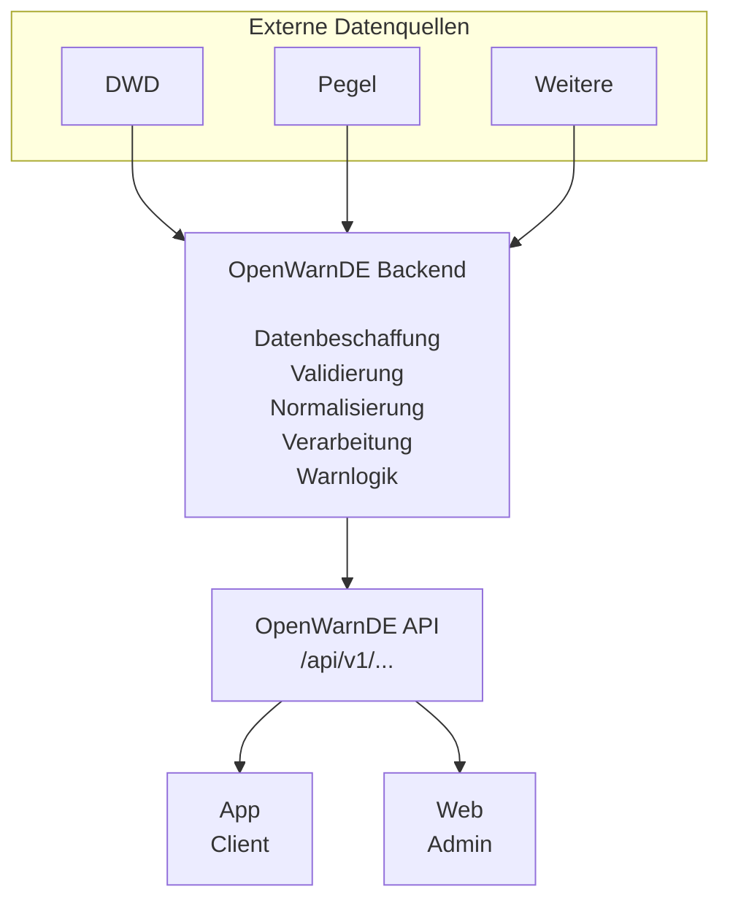
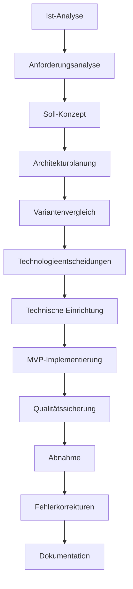

# Soll-/Ist-Analyse und Projektplanung

## 1. Projektüberblick

### 1.1 Projektbezeichnung

**Neukonzeption und prototypische Entwicklung der Warn- und Lageinformationsplattform OpenWarnDE 2.0**

Ausgangspunkt des Projekts ist das bestehende OpenWarnDEV-System. Dieses stellt bereits grundlegende Funktionen einer Warn- und Lageinformationsplattform bereit. Dazu gehören insbesondere eine interaktive Kartenansicht, die Ermittlung des eigenen Standorts sowie die Nutzung auf verschiedenen Endgeräten.

Ziel des Projekts ist die Untersuchung und strukturierte Weiterentwicklung des bestehenden Systems zu einer neuen Version OpenWarnDE 2.0. Dabei sollen geeignete Bestandteile übernommen und weiterverwendet werden. Nicht geeignete oder technisch überholte Ansätze sollen überarbeitet oder durch neue Lösungen ersetzt werden.

Das Projekt wird als eigenständiges Produktprojekt durchgeführt. Der Schwerpunkt liegt daher nicht auf einem unmittelbaren wirtschaftlichen Auftraggebernutzen, sondern auf der Schaffung einer strukturierten und erweiterbaren technischen Grundlage.

---

## 2. Projektumfeld

### 2.1 Schulisches Umfeld

Das Projekt wird im Rahmen des Lernfeldes LF12 an der Berufsschule durchgeführt. Es dient der Vorbereitung auf die IHK-Abschlussprüfung zum Fachinformatiker für Anwendungsentwicklung. Die Bewertung erfolgt anhand der Vorgaben des IHK-Merkblatts sowie des Arbeitsauftrags AB401. Die Zwischenabgabe „Soll-/Ist-Analyse und Projektplanung“ ist Bestandteil der Projektbewertung.

### 2.2 Technisches Umfeld

Die Entwicklung erfolgt lokal auf einem Entwicklungsrechner. Zur Versionsverwaltung wird GitHub genutzt. Als Technologien kommen Next.js, React, TypeScript, MapLibre GL JS, Capacitor und Firebase zum Einsatz. Die Anwendung wird als Web-Client sowie optional als mobile Anwendung über Capacitor bereitgestellt.

### 2.3 Zeitliches Umfeld

Das Projekt wird eigenständig in der Freizeit durchgeführt. Der Gesamtaufwand beträgt laut Projektantrag 80 Stunden. Der Bearbeitungszeitraum erstreckt sich vom 28.09.2026 bis zum 24.01.2027.

### 2.4 Personelles Umfeld

Das Projekt wird als Einzelprojekt durchgeführt. Es gibt keine Teammitglieder. Der Projektbearbeiter übernimmt alle Rollen: Projektplanung, Analyse, Architektur, Entwicklung, Qualitätssicherung und Dokumentation.

---

## 3. Ist-Analyse

### 3.1 Ausgangszustand

OpenWarnDEV stellt bereits einen funktionsfähigen Prototypen einer Warn- und Lageinformationsplattform dar. Die Anwendung verfügt unter anderem über eine interaktive Kartenansicht, eine Standortermittlung sowie eine auf unterschiedliche Endgeräte ausgelegte technische Grundlage.

Die bestehende Anwendung wurde über einen längeren Zeitraum erweitert. Dabei wurden zusätzliche Funktionen und technische Konzepte schrittweise ergänzt. Dadurch entstand eine gewachsene Struktur, bei der die einzelnen Bestandteile nicht von Beginn an auf eine einheitliche Gesamtarchitektur ausgerichtet wurden.

Für die weitere Entwicklung ergibt sich daraus das Problem, dass neue Funktionen zunehmend schwieriger strukturiert integriert werden können. Außerdem sind Verantwortlichkeiten zwischen Client, Datenverarbeitung und zukünftigen Backend-Funktionen nicht eindeutig voneinander getrennt.

### 3.2 Technischer Ist-Zustand

Die bestehende Anwendung verwendet unter anderem folgende Technologien:

| Bereich            | Ist-Zustand                 |
| ------------------ | --------------------------- |
| Frontend           | Next.js / React             |
| Programmiersprache | TypeScript                  |
| Kartenengine       | MapLibre GL JS              |
| Mobile Nutzung     | Capacitor                   |
| Standortermittlung | Capacitor Geolocation       |
| Hosting            | Firebase Hosting            |
| Kartendaten        | OpenStreetMap / OpenFreeMap |
| Zustandsverwaltung | Zustand                     |
| Styling/UI         | Tailwind CSS / Flowbite     |
| Qualitätssicherung | ESLint sowie manuelle Tests |

Die vorhandene Kartenfunktion ist bereits vergleichsweise weit entwickelt. Neben der grundlegenden Kartendarstellung existieren unter anderem 3D-Gelände, 3D-Gebäude, Kartensteuerungen, Standortanzeige und ein Deutschland-Fokus.

Damit besitzt OpenWarnDEV bereits technische Bestandteile, die für OpenWarnDE 2.0 wiederverwendet werden können.

### 3.3 Technische Probleme

Aus der Untersuchung ergeben sich insbesondere folgende Problemfelder:

1. **Gewachsene Projektstruktur**
   Funktionen wurden im Laufe der Entwicklung ergänzt. Dadurch ist die technische Struktur nicht vollständig auf eine langfristige Erweiterbarkeit ausgelegt.

2. **Fehlende klare Trennung der Verantwortlichkeiten**
   Die zukünftige Trennung zwischen Client, Backend, Datenverarbeitung und API ist im bestehenden System noch nicht konsequent umgesetzt.

3. **Direkte Abhängigkeiten von externen Datenquellen**
   Eine zentrale Plattformarchitektur soll zukünftig dafür sorgen, dass externe Datenquellen nicht von jedem Client separat verarbeitet werden müssen.

4. **Fehlende zentrale Datenverarbeitung**
   Datenbeschaffung, Normalisierung und Warnlogik sollen zukünftig zentral erfolgen.

5. **Erweiterbarkeit**
   Neue Datenquellen, Warnlogiken und Betriebsmodi sollen zukünftig modular ergänzt werden können.

6. **Sicherheit**
   Administrative Funktionen und Berechtigungen sollen nicht ausschließlich über den Client gesteuert werden. Berechtigungen müssen serverseitig geprüft werden.

---

## 4. Soll-Analyse

### 4.1 Zielzustand

OpenWarnDE 2.0 soll als modular aufgebaute Plattform konzipiert werden.

Die zentrale Architektur besteht aus:

- OpenWarnDE App
- OpenWarnDE Web Platform
- OpenWarnDE Backend
- OpenWarnDE API
- zentraler Datenverarbeitung
- externen Datenquellen

Die App soll zukünftig ausschließlich als Client der Plattform fungieren. Die Verarbeitung externer Datenquellen soll zentral über das Backend erfolgen.

Dadurch werden Datenbeschaffung, Normalisierung, Warnlogik und Veröffentlichung von der Darstellung im Client getrennt.

### 4.2 Zielarchitektur



Die Architektur soll dabei zunächst als modularer Monolith umgesetzt werden. Fachliche Bereiche werden voneinander getrennt, müssen jedoch nicht bereits im MVP als voneinander unabhängige Microservices betrieben werden.

Dadurch soll die technische Komplexität des MVP begrenzt werden.

---

## 5. Anforderungsanalyse

### 5.1 Funktionale Anforderungen

| ID  | Anforderung                                                                   | Priorität |
| --- | ----------------------------------------------------------------------------- | --------- |
| F01 | Die Anwendung muss eine interaktive Karte darstellen.                         | Muss      |
| F02 | Der aktuelle Standort des Nutzers muss ermittelt und angezeigt werden können. | Muss      |
| F03 | Die Karte muss durchsucht werden können.                                      | Muss      |
| F04 | Die Kartendarstellung muss angepasst werden können.                           | Muss      |
| F05 | Es muss eine grundlegende Verwaltungsoberfläche vorhanden sein.               | Muss      |
| F06 | Der Zugriff auf Verwaltungsfunktionen muss kontrolliert werden.               | Muss      |
| F07 | Warnungen müssen manuell erstellt werden können.                              | Muss      |
| F08 | Warnungen müssen über Push-Nachrichten ausgelöst werden können.               | Muss      |
| F09 | Die Anwendung soll auf verschiedenen Endgeräten nutzbar sein.                 | Soll      |
| F10 | Die Architektur soll zukünftig weitere Datenquellen aufnehmen können.         | Soll      |
| F11 | Die API soll versioniert aufgebaut werden.                                    | Soll      |
| F12 | Eine spätere Erweiterung um weitere Betriebsmodi soll möglich sein.           | Kann      |

### 5.2 Nichtfunktionale Anforderungen

| ID   | Anforderung                                                                                                   |
| ---- | ------------------------------------------------------------------------------------------------------------- |
| NF01 | Die Anwendung muss in mindestens drei fachlich getrennte Module unterteilt sein.                              |
| NF02 | Die Architektur muss so gestaltet sein, dass neue Datenquellen ohne Änderung am Client ergänzt werden können. |
| NF03 | Administrative Berechtigungen müssen serverseitig überprüfbar sein.                                           |
| NF04 | Die API muss eine einheitliche, versionierte Schnittstelle bereitstellen.                                     |
| NF05 | Die Anwendung muss auf unterstützten mobilen und webbasierten Endgeräten nutzbar sein.                        |
| NF06 | Der Quellcode muss nachvollziehbar strukturiert und dokumentiert sein.                                        |
| NF07 | Die Anwendung muss durch automatisierte und manuelle Tests abgesichert werden.                                |
| NF08 | Externe Datenquellen müssen austauschbar bzw. erweiterbar sein.                                               |

---

## 6. Abgrenzung des MVP

Der Projektumfang wird bewusst begrenzt.

### 6.1 Bestandteil des MVP

- strukturierte Client-Anwendung
- interaktive Karte
- Standortermittlung
- Kartensuche
- Anpassung der Kartendarstellung
- grundlegende Verwaltungsoberfläche
- grundlegendes Zugriffskonzept
- manuelles Erstellen von Warnungen
- manuelles Auslösen von Push-Nachrichten
- automatisierte und manuelle Qualitätssicherung

### 6.2 Nicht Bestandteil des MVP

- vollständige Developer Platform
- Billing-System
- vollständige externe API-Kundenverwaltung
- komplexes Tarifmodell
- vollständige Microservice-Infrastruktur
- produktiver deutschlandweiter Betrieb
- vollständige automatische Risikobewertung aller Datenquellen

Diese Funktionen können Bestandteil der langfristigen Weiterentwicklung sein, werden jedoch nicht innerhalb des 80-Stunden-Projektumfangs umgesetzt.

---

## 7. Projektschnittstellen

### 7.1 Technische Schnittstellen

Die wichtigsten technischen Schnittstellen sind:

- Kartenengine ↔ Kartendaten
- App ↔ OpenWarnDE API
- Backend ↔ externe Datenquellen
- Backend ↔ Datenhaltung
- Backend ↔ Push-Dienst
- Web Platform ↔ Backend/API
- GitHub ↔ Entwicklungs- und Versionsverwaltung
- CI/CD ↔ Deployment

### 7.2 Organisatorische Schnittstellen

Das Projekt wird eigenständig durchgeführt. Die Entwicklungsplanung, Implementierung, Qualitätssicherung und Dokumentation liegen beim Projektbearbeiter.

GitHub dient als zentrale Plattform für Quellcodeverwaltung, Versionskontrolle und nachvollziehbare Entwicklungsstände.

### 7.3 Personelle Schnittstellen

Der Projektbearbeiter übernimmt die Rollen:

- Projektplanung
- Analyse
- Architektur
- Entwicklung
- Qualitätssicherung
- Dokumentation

Im schulischen Kontext erfolgt die Bewertung anhand der vorgegebenen Projekt- und Dokumentationskriterien.

---

## 8. Variantenvergleich

Für die zukünftige Architektur wurden drei grundsätzliche Varianten betrachtet.

| Variante | Beschreibung                                     | Vorteile                                                  | Nachteile                                         |
| -------- | ------------------------------------------------ | --------------------------------------------------------- | ------------------------------------------------- |
| A        | Bestehende OpenWarnDEV-Struktur weiterentwickeln | geringer initialer Aufwand, Wiederverwendung              | bestehende strukturelle Probleme bleiben bestehen |
| B        | Vollständige Microservice-Architektur            | starke technische Trennung, hohe Skalierbarkeit           | hohe Komplexität, hoher Betriebsaufwand           |
| C        | Modularer Monolith mit klaren Schnittstellen     | klare Struktur, geringere Komplexität, später erweiterbar | weniger physische Trennung als Microservices      |

Für den MVP wird Variante C verwendet.

Die Entscheidung basiert darauf, dass die fachlichen Bereiche bereits sauber getrennt werden können, ohne den zusätzlichen Betriebs- und Entwicklungsaufwand einer vollständigen Microservice-Architektur zu verursachen.

Die langfristige Aufteilung einzelner Module in eigenständige Services bleibt dadurch möglich.

---

## 9. Technologieentscheidungen

### 9.1 Frontend

Für den Client soll die bestehende technische Grundlage aus Next.js, React und TypeScript weiterverwendet werden.

Vorteile:

- vorhandene Kenntnisse und Komponenten
- Wiederverwendung bestehender Funktionen
- TypeScript ermöglicht statische Typprüfung
- React eignet sich für komponentenbasierte Benutzeroberflächen

### 9.2 Kartenengine

MapLibre GL JS wird weiterhin eingesetzt.

Die bestehende Anwendung verfügt bereits über eine entsprechende Kartenimplementierung einschließlich 3D-Terrain, 3D-Gebäuden und Standortdarstellung.

Dadurch kann vorhandene Entwicklungsarbeit weiterverwendet werden.

### 9.3 Mobile Plattform

Capacitor wird für die mobile Bereitstellung verwendet.

Dadurch kann die Webanwendung auf Basis derselben Client-Anwendung auch für mobile Plattformen vorbereitet werden.

### 9.4 Backend

Das Backend soll als zentraler Verarbeitungskern aufgebaut werden.

Die fachlichen Bereiche sollen zunächst innerhalb eines modularen Backends getrennt werden.

Mögliche Bereiche sind:

```text
api/
ingestion/
processing/
warnings/
notifications/
usage/
shared/
```

Eine Aufteilung in eigenständige Services ist erst dann vorgesehen, wenn dafür ein konkreter technischer Vorteil entsteht.

### 9.5 API

Die Kommunikation zwischen Client und Backend soll über eine eigene OpenWarnDE API erfolgen.

Die API soll versioniert werden, beispielsweise:

```text
/api/v1/warnings
```

Dadurch können spätere Breaking Changes über eine neue API-Version eingeführt werden, ohne bestehende Clients unmittelbar zu verändern.

---

## 10. Wirtschaftlichkeitsbetrachtung

### 10.1 Direkter wirtschaftlicher Nutzen

Das Projekt wird eigenständig und ohne externen Auftraggeber entwickelt. Es entstehen keine direkten Einnahmen und kein unmittelbarer Verkaufserlös. Ein direkter wirtschaftlicher Nutzen für einen externen Auftraggeber liegt daher nicht vor.

### 10.2 Indirekter wirtschaftlicher Nutzen

Durch die strukturierte Neuentwicklung entsteht eine technische Grundlage, die zukünftige Entwicklungsaufwände reduziert, die Wartbarkeit verbessert und die Wiederverwendung bestehender Komponenten ermöglicht. Langfristig kann daraus ein produktisierbares System entstehen. Zusätzlich dient das Projekt der Qualifikation und Portfolio-Erweiterung des Entwicklers.

Der wesentliche indirekte Nutzen liegt in:

- der Schaffung einer strukturierten technischen Grundlage,
- der Reduzierung zukünftiger Entwicklungsaufwände,
- der besseren Wartbarkeit,
- der Wiederverwendbarkeit bestehender Komponenten,
- der Möglichkeit zur späteren Erweiterung,
- der praktischen Vertiefung der erworbenen Kenntnisse.

Durch die Wiederverwendung geeigneter Bestandteile aus OpenWarnDEV können bereits vorhandene Entwicklungsleistungen weiter genutzt werden.

Insbesondere die vorhandene Kartenfunktion, Standortermittlung und technische Client-Grundlage müssen dadurch nicht vollständig neu entwickelt werden.

### 10.3 Kostenbetrachtung

Der Projektantrag sieht einen Gesamtaufwand von 80 Stunden vor.

Für eine beispielhafte interne Kostenbetrachtung kann ein kalkulatorischer Entwicklungsstundensatz verwendet werden.

Beispiel:

```text
80 Stunden × 40,00 € / Stunde = 3.200,00 €
```

Der Stundensatz stellt dabei eine Kalkulationsannahme und keinen tatsächlichen Projektpreis dar.

Weitere direkte Softwarekosten sollen durch die Verwendung vorhandener bzw. frei nutzbarer Technologien möglichst gering gehalten werden.

---

## 11. Ressourcenplanung

Für die Umsetzung werden folgende Ressourcen benötigt:

### 11.1 Hardware

- Entwicklungsrechner / Notebook
- mobiles Testgerät
- Internetzugang

### 11.2 Software

- Visual Studio Code oder vergleichbare Entwicklungsumgebung
- Git
- GitHub
- Node.js
- TypeScript
- Next.js
- React
- MapLibre GL JS
- Capacitor
- Firebase

### 11.3 Organisatorische Ressourcen

- 80 Stunden Projektarbeitszeit
- Versionsverwaltung über GitHub
- Dokumentation der Architektur und Entscheidungen
- Test- und Abnahmezeit

---

## 12. Ablauf- und Zeitplanung

Die Zeitplanung orientiert sich an dem im Projektantrag festgelegten Gesamtaufwand von 80 Stunden. Die einzelnen Phasen werden in Unterpunkte aufgeteilt und jeweils mit einer eigenen zeitlichen Einschätzung versehen.

|   Phase    | Tätigkeit                                                      |  Aufwand |
| :--------: | -------------------------------------------------------------- | -------: |
|   **1**    | **Analyse des bestehenden OpenWarnDEV-Systems**                |  **8 h** |
|    1.1     | Analyse der Frontend-Struktur (Next.js / React)                |      2 h |
|    1.2     | Analyse der Kartenfunktion (MapLibre GL JS)                    |      2 h |
|    1.3     | Analyse der Standortermittlung und mobilen Nutzung (Capacitor) |      1 h |
|    1.4     | Analyse des Hostings und Deployments (Firebase)                |      1 h |
|    1.5     | Dokumentation der Analyseergebnisse                            |      2 h |
|   **2**    | **Anforderungsanalyse und Projektplanung**                     |  **8 h** |
|    2.1     | Ermittlung der Nutzergruppen und Stakeholder                   |      1 h |
|    2.2     | Erhebung funktionaler Anforderungen                            |    1,5 h |
|    2.3     | Erhebung nichtfunktionaler Anforderungen                       |      1 h |
|    2.4     | Priorisierung der Anforderungen                                |      1 h |
|    2.5     | Abgrenzung des MVP                                             |      1 h |
|    2.6     | Risikoanalyse                                                  |    0,5 h |
|    2.7     | Wirtschaftlichkeitsanalyse (direkter/indirekter Nutzen)        |      1 h |
|    2.8     | Kostenrechnung und Nutzen-Kosten-Vergleich                     |    0,5 h |
|    2.9     | Erstellung der Projektplanung                                  |    0,5 h |
|   **3**    | **Soll-Konzept und Architekturplanung**                        |  **8 h** |
|    3.1     | Definition der Zielarchitektur                                 |      2 h |
|    3.2     | Modulaufteilung des Backends                                   |      2 h |
|    3.3     | API-Design und Versionierung                                   |      1 h |
|    3.4     | Datenflussmodellierung                                         |      1 h |
|    3.5     | Erstellung der Architekturdiagramme                            |      2 h |
|   **4**    | **Variantenvergleich und Technologieentscheidungen**           |  **6 h** |
|    4.1     | Vergleich der Architekturvarianten A/B/C                       |      2 h |
|    4.2     | Bewertung der Technologien (Frontend, Backend, API)            |      2 h |
|    4.3     | Dokumentation der Entscheidungen                               |      2 h |
|   **5**    | **Einrichtung der technischen Projektgrundlage**               |  **6 h** |
|    5.1     | Einrichtung der Repository-Struktur                            |      1 h |
|    5.2     | Projektkonfiguration (Next.js, TypeScript, ESLint)             |      2 h |
|    5.3     | Einrichtung der Entwicklungsumgebung                           |      1 h |
|    5.4     | Einrichtung der CI/CD-Grundlage                                |      1 h |
|    5.5     | Installation erster Abhängigkeiten                             |      1 h |
|   **6**    | **Implementierung des MVP**                                    | **22 h** |
|    6.1     | Erstellung der Client-Grundstruktur                            |      3 h |
|    6.2     | Implementierung der interaktiven Kartenansicht                 |      4 h |
|    6.3     | Implementierung der Standortermittlung                         |      2 h |
|    6.4     | Implementierung der Kartensuche                                |      2 h |
|    6.5     | Implementierung der Anpassung der Kartendarstellung            |      2 h |
|    6.6     | Implementierung der Verwaltungsoberfläche                      |      3 h |
|    6.7     | Implementierung des Zugriffskonzepts                           |      2 h |
|    6.8     | Implementierung der manuellen Warnungserstellung               |      2 h |
|    6.9     | Implementierung des manuellen Push-Versands                    |      2 h |
|   **7**    | **Qualitätssicherung und Tests**                               |  **6 h** |
|    7.1     | Erstellung der Testfälle                                       |      1 h |
|    7.2     | Durchführung funktionaler Tests                                |      2 h |
|    7.3     | Durchführung manueller Tests                                   |      1 h |
|    7.4     | Fehlerbehebung                                                 |      1 h |
|    7.5     | Dokumentation der Testergebnisse                               |      1 h |
|   **8**    | **Abnahme und Fehlerkorrekturen**                              |  **4 h** |
|    8.1     | Durchführung der Abnahmetests                                  |      2 h |
|    8.2     | Fehlerkorrekturen                                              |      1 h |
|    8.3     | Erneute Prüfung und Abschluss                                  |      1 h |
|   **9**    | **Projektdokumentation**                                       | **12 h** |
|    9.1     | Erstellung der End-User-Dokumentation                          |      3 h |
|    9.2     | Erstellung der Entwicklerdokumentation                         |      4 h |
|    9.3     | Erstellung der Projektdokumentation                            |      3 h |
|    9.4     | Fazit und Ausblick                                             |      2 h |
| **Gesamt** |                                                                | **80 h** |

---

## 13. Wirtschaftlicher Nutzen im Projektverlauf

Die folgende Übersicht stellt dar, an welchen Stellen im Projektverlauf wirtschaftlich relevanter Nutzen entsteht.

| Phase | Wirtschaftlicher Bezug                                                           |
| :---: | -------------------------------------------------------------------------------- |
|   1   | Identifikation wiederverwendbarer Komponenten → spart später Entwicklungsaufwand |
|   2   | Klare Anforderungen vermeiden spätere Nachbesserungskosten                       |
|   3   | Strukturierte Architektur senkt langfristige Wartungskosten                      |
|   4   | Technologieentscheidungen beeinflussen langfristige Betriebskosten               |
|   5   | Wiederverwendung vorhandener Infrastruktur und Komponenten                       |
|   6   | Wiederverwendung bestehender Komponenten reduziert Implementierungsaufwand       |
|   7   | Frühzeitige Fehlererkennung senkt Folgekosten                                    |
|   8   | Sichere Abnahme reduziert spätere Korrekturkosten                                |
|   9   | Gute Dokumentation senkt Einarbeitungs- und Wartungskosten                       |

---

## 14. Projektablauf

Der geplante Projektablauf wird in folgende Schritte unterteilt:



Besonders wichtig ist die Trennung zwischen Analyse und Implementierung. Die technische Umsetzung soll erst beginnen, nachdem Anforderungen, Architektur und MVP-Umfang festgelegt wurden.

---

## 15. Projektrisiken

| Risiko                                             | Eintritt | Auswirkung | Gegenmaßnahme                                                                                                            |
| -------------------------------------------------- | -------- | ---------- | ------------------------------------------------------------------------------------------------------------------------ |
| Bestehende Komponenten sind nicht wiederverwendbar | mittel   | mittel     | Frühzeitige technische Analyse der bestehenden Komponenten; bei Nichtverwendbarkeit frühzeitige Neuentwicklung einplanen |
| MVP wird zu umfangreich                            | hoch     | hoch       | Klare Abgrenzung des MVP; regelmäßige Prüfung des Umfangs gegen die 80-Stunden-Planung                                   |
| Backend-Aufwand wird unterschätzt                  | mittel   | hoch       | Zunächst modularer Monolith statt Microservices; schrittweise Erweiterung                                                |
| Probleme mit externen Datenquellen                 | mittel   | mittel     | Schnittstellen abstrahieren; Mock-Daten für Entwicklung verwenden                                                        |
| Mobile Plattform verursacht zusätzlichen Aufwand   | mittel   | mittel     | Zunächst Client-Funktionalität priorisieren; mobile Anpassung nachrangig                                                 |
| Zeitüberschreitung                                 | mittel   | hoch       | Regelmäßiger Abgleich mit 80-Stunden-Plan; Priorisierung der Muss-Anforderungen                                          |
| Fehler werden spät erkannt                         | mittel   | mittel     | Kontinuierliche Tests während der Implementierung; frühzeitige Qualitätssicherung                                        |

---

## 16. Abnahmekriterien

Der MVP gilt als erfolgreich umgesetzt, wenn mindestens folgende Punkte erfüllt sind:

- die Anwendung kann gestartet und verwendet werden,
- die Karte wird korrekt dargestellt,
- der eigene Standort kann ermittelt werden,
- die Karte kann gesucht und bedient werden,
- die geplante Grundstruktur des Clients ist vorhanden,
- die Verwaltungsoberfläche ist erreichbar,
- das Zugriffskonzept funktioniert für den definierten Anwendungsfall,
- eine Warnung kann manuell erstellt werden,
- eine Push-Nachricht kann manuell ausgelöst werden,
- relevante Funktionen wurden getestet,
- bekannte Fehler wurden dokumentiert bzw. behoben,
- die technische Grundlage ist für eine spätere Erweiterung geeignet.

---

## 17. Ergebnis der Soll-/Ist-Analyse

Die Analyse zeigt, dass OpenWarnDEV bereits eine funktionsfähige technische Grundlage besitzt, insbesondere im Bereich der Kartenanwendung und der mobilen Nutzung.

Für die weitere Entwicklung ist jedoch eine stärkere strukturelle Trennung erforderlich.

OpenWarnDE 2.0 soll deshalb nicht lediglich eine weitere Ausbaustufe der bestehenden Anwendung darstellen. Stattdessen wird eine neue Plattformstruktur definiert, bei der Client, API, Backend, Datenverarbeitung und Verwaltung klar voneinander getrennt werden.

Durch die Wiederverwendung geeigneter Bestandteile des bestehenden Systems kann vorhandene Entwicklungsarbeit genutzt werden. Gleichzeitig werden problematische oder nicht mehr geeignete Strukturen nicht unverändert übernommen.

Das Ergebnis der Planungsphase ist damit ein klar abgegrenztes MVP mit einer modularen Zielarchitektur, auf der spätere Funktionen aufbauen können.